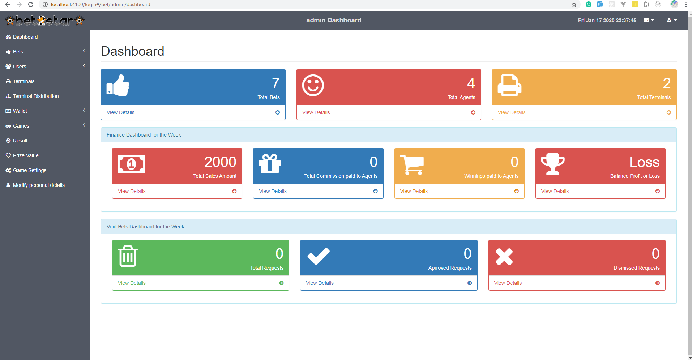
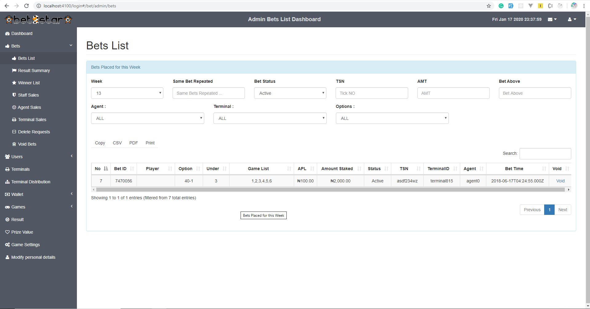
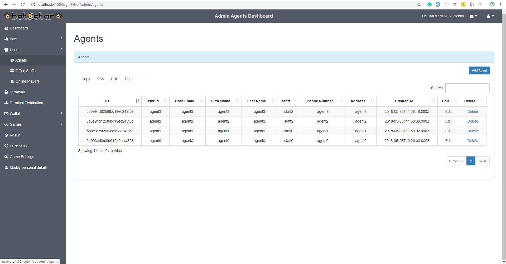
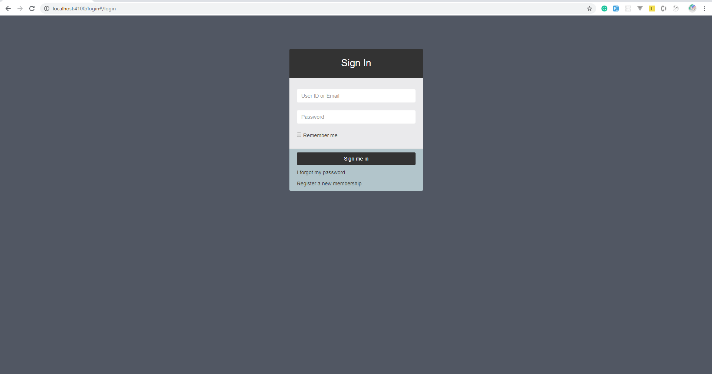
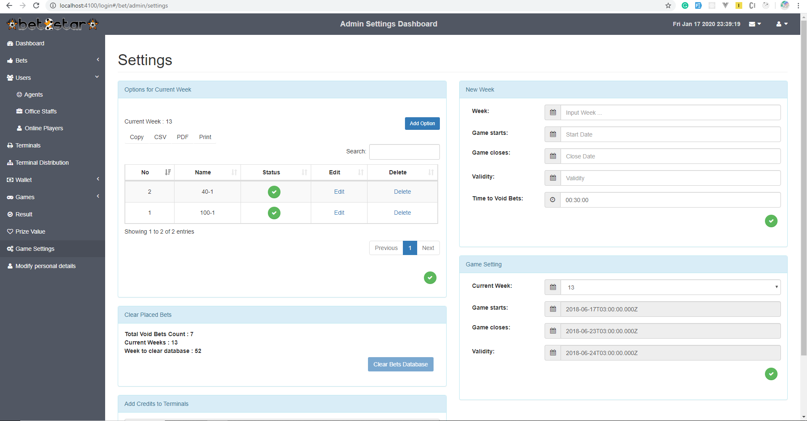
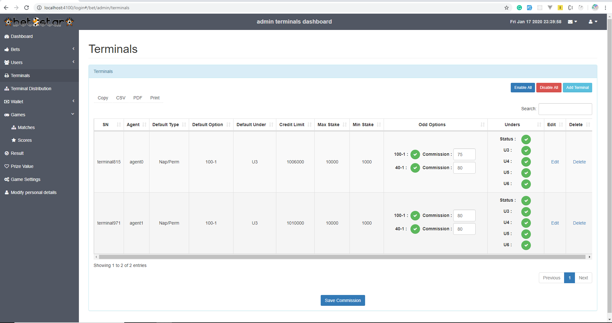

# Project
This system is betting admin platform where you can manage games, users, bets, terminals, wallet and the bet result. There is also sales management for staff, agent and terminal’s cases. 

# Technology
Nodejs, Express, Angular1.5, Metronic, Mongodb

## Import Data

1. **Use your own database credentials**

   ```bash
   mongoimport --uri "mongodb://<username>:<password>@localhost:27017/<database>" --collection users --file ./db-import.json --jsonArray
   ```

   - Replace `<username>` with your MongoDB username.
   - Replace `<password>` with your MongoDB password.
   - Replace `<database>` with your target database name.

## Setup Project

1. **Backend Setup**

   - Ensure you are in the root folder of your project.
   - Install dependencies using npm, yarn, or pnpm:

     ```bash
     # Using npm
     npm install

     # Or using yarn
     yarn install

     # Or using pnpm
     pnpm install
     ```

2. **Frontend Setup**

   - Navigate to the client directory:

     ```bash
     cd client
     ```

   - Install Bower globally:

     ```bash
     npm install -g bower
     ```

   - Install frontend dependencies using Bower:

     ```bash
     bower install
     ```

## Run the Project

1. Start the server:

   ```bash
   node server.js
   ```

# Images






